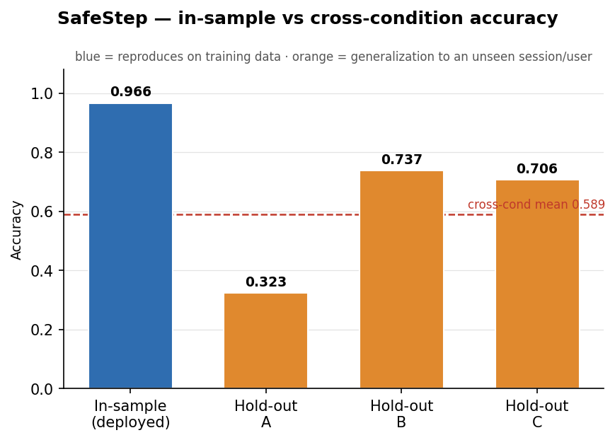
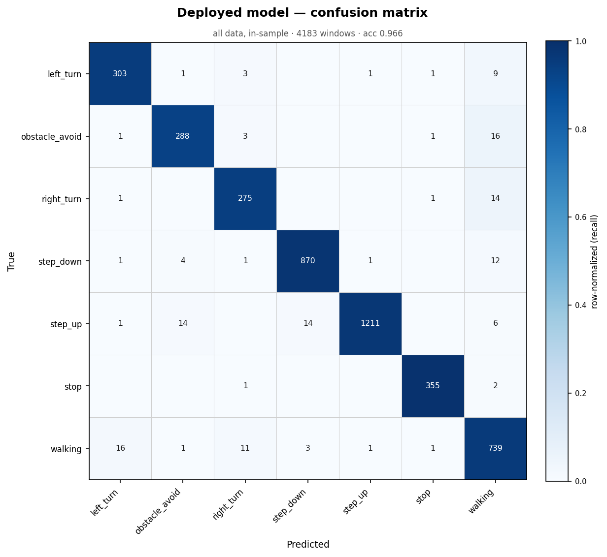
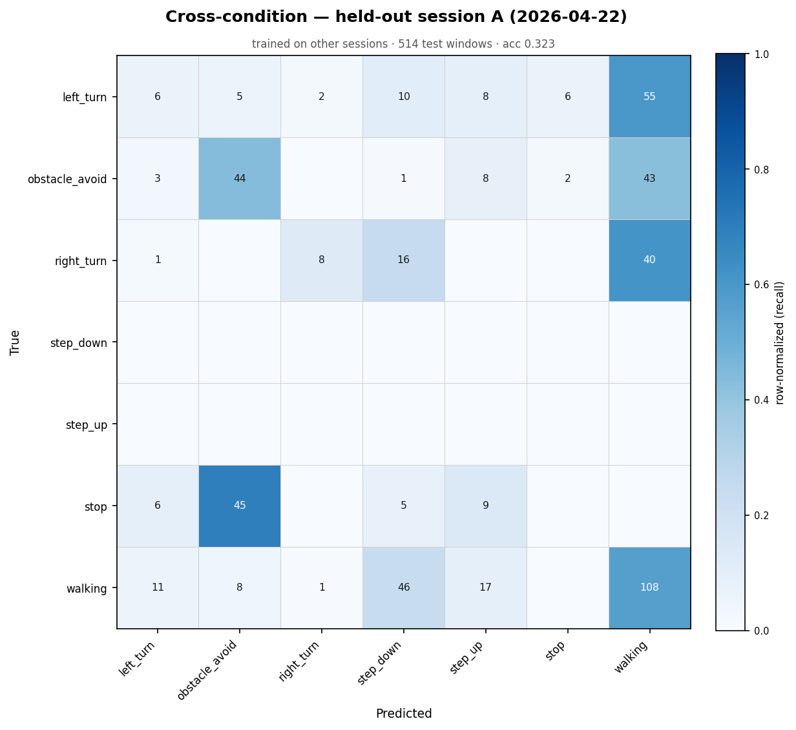
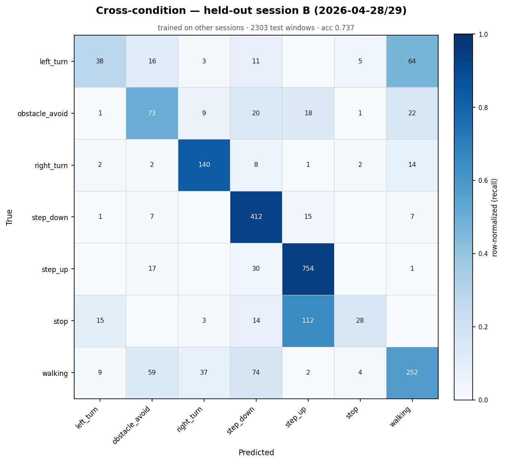
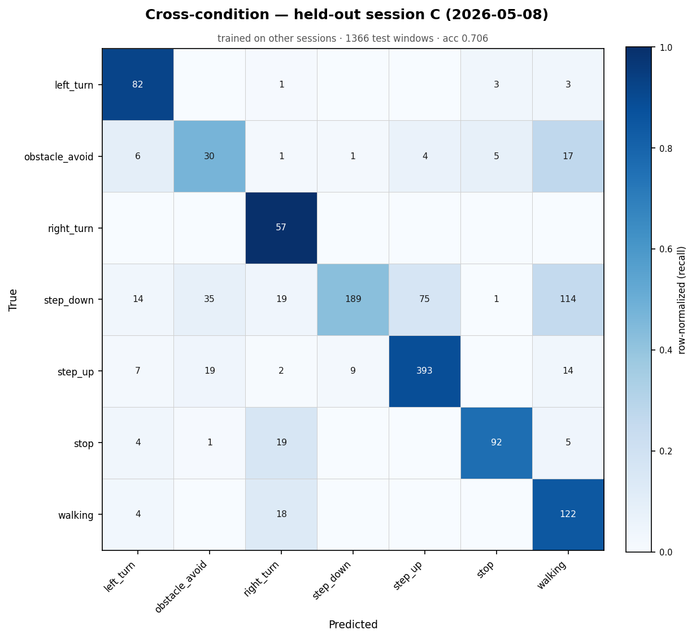

# SafeStep — E2E Pipeline & Cross-Condition Results

_Generated 2026-06-05 12:27:56_

## Summary



The pipeline reproduces perfectly on training data (**0.966** in-sample) but generalization to an unseen session/user averages **0.589** — the gap is the cross-condition story (see Part 2).

## Pipeline

`raw sensor CSV → clean (lidar/ultrasonic gap-fill) → sliding window (5 samples, step 2) → DSP features (mean/std/min/max × 10 channels = 40 features) → Random Forest → activity label`

This is byte-for-byte the same DSP + classifier the firmware runs on-device (`src/main.cpp` `computeFeatures()` + `clf.predict()`).


## Part 1 — Consecutive E2E runs

Each run re-executes the *entire* pipeline from raw CSVs through inference and records its own log file.

| Run | Files | Windows | Wall time | Accuracy | Log |
|----|------|--------|----------|---------|-----|
| 1 | 95 | 4183 | 3338.0 ms | 0.9661 | `results/e2e_run1_20260605_122747.txt` |
| 2 | 95 | 4183 | 3395.5 ms | 0.9661 | `results/e2e_run2_20260605_122751.txt` |

**Reproducibility:** run 1 and run 2 produced **identical** predictions ✓ (deterministic pipeline).




> Note: Part-1 accuracy is in-sample (the deployed model was trained on this data). It demonstrates the pipeline executes and reproduces — not generalization. For generalization see Part 2.


## Part 2 — Cross-condition (leave-one-session-out)

Data spans 3 collection sessions (different days / users / environments). Each is held out in turn; the model trains only on the other two and is tested on the unseen session.

| Held-out session | Train win | Test win | Classes | Accuracy |
|---|---|---|---|---|
| A (2026-04-22) | 3669 | 514 | 5 | **0.323** |
| B (2026-04-28/29) | 1880 | 2303 | 7 | **0.737** |
| C (2026-05-08) | 2817 | 1366 | 7 | **0.706** |
| **mean** | | | | **0.589** |

### Held-out session A (2026-04-22)

- Train windows: 3669  |  Test windows: 514
- Classes present in test: 5 (left_turn, obstacle_avoid, right_turn, stop, walking)
- **Cross-condition accuracy: 0.323**



```
                precision    recall  f1-score   support

     left_turn      0.222     0.065     0.101        92
obstacle_avoid      0.431     0.436     0.433       101
    right_turn      0.727     0.123     0.211        65
     step_down      0.000     0.000     0.000         0
       step_up      0.000     0.000     0.000         0
          stop      0.000     0.000     0.000        65
       walking      0.439     0.565     0.494       191

      accuracy                          0.323       514
     macro avg      0.260     0.170     0.177       514
  weighted avg      0.380     0.323     0.314       514

Confusion matrix (rows=true, cols=pred):
                left_turn  obstacle_avoid  right_turn  step_down  step_up  stop  walking
left_turn               6               5           2         10        8     6       55
obstacle_avoid          3              44           0          1        8     2       43
right_turn              1               0           8         16        0     0       40
step_down               0               0           0          0        0     0        0
step_up                 0               0           0          0        0     0        0
stop                    6              45           0          5        9     0        0
walking                11               8           1         46       17     0      108
```

### Held-out session B (2026-04-28/29)

- Train windows: 1880  |  Test windows: 2303
- Classes present in test: 7 (left_turn, obstacle_avoid, right_turn, step_down, step_up, stop, walking)
- **Cross-condition accuracy: 0.737**



```
                precision    recall  f1-score   support

     left_turn      0.576     0.277     0.374       137
obstacle_avoid      0.420     0.507     0.459       144
    right_turn      0.729     0.828     0.776       169
     step_down      0.724     0.932     0.815       442
       step_up      0.836     0.940     0.885       802
          stop      0.700     0.163     0.264       172
       walking      0.700     0.577     0.632       437

      accuracy                          0.737      2303
     macro avg      0.669     0.603     0.601      2303
  weighted avg      0.729     0.737     0.712      2303

Confusion matrix (rows=true, cols=pred):
                left_turn  obstacle_avoid  right_turn  step_down  step_up  stop  walking
left_turn              38              16           3         11        0     5       64
obstacle_avoid          1              73           9         20       18     1       22
right_turn              2               2         140          8        1     2       14
step_down               1               7           0        412       15     0        7
step_up                 0              17           0         30      754     0        1
stop                   15               0           3         14      112    28        0
walking                 9              59          37         74        2     4      252
```

### Held-out session C (2026-05-08)

- Train windows: 2817  |  Test windows: 1366
- Classes present in test: 7 (left_turn, obstacle_avoid, right_turn, step_down, step_up, stop, walking)
- **Cross-condition accuracy: 0.706**



```
                precision    recall  f1-score   support

     left_turn      0.701     0.921     0.796        89
obstacle_avoid      0.353     0.469     0.403        64
    right_turn      0.487     1.000     0.655        57
     step_down      0.950     0.423     0.585       447
       step_up      0.833     0.885     0.858       444
          stop      0.911     0.760     0.829       121
       walking      0.444     0.847     0.582       144

      accuracy                          0.706      1366
     macro avg      0.668     0.758     0.673      1366
  weighted avg      0.791     0.706     0.703      1366

Confusion matrix (rows=true, cols=pred):
                left_turn  obstacle_avoid  right_turn  step_down  step_up  stop  walking
left_turn              82               0           1          0        0     3        3
obstacle_avoid          6              30           1          1        4     5       17
right_turn              0               0          57          0        0     0        0
step_down              14              35          19        189       75     1      114
step_up                 7              19           2          9      393     0       14
stop                    4               1          19          0        0    92        5
walking                 4               0          18          0        0     0      122
```
